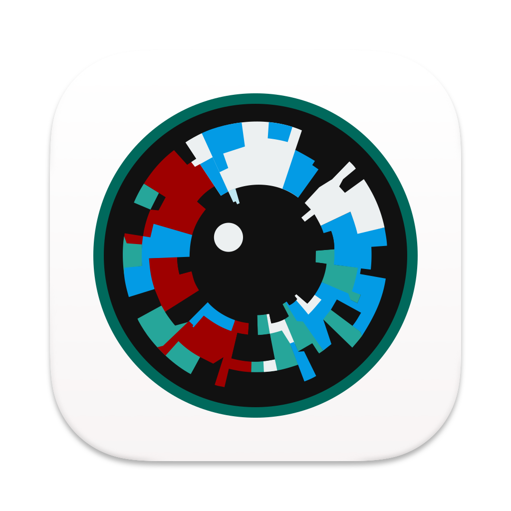

# Skyle IK App

This is the official Skyle IK App for the Skyle Integration Kit by eyeV GmbH.

The Skyle Integration Kit is a remote eye-tracker which is available here: [https://eyev.de/sik](https://eyev.de/sik).

With Skyle IK you can create products which support eye-tracking. Skyle IK is specifically designed to be integrated with any programming language with the open sourced [gRPC protos](https://github.com/eyev-de/Skyle.proto).

The Skyle IK is written in flutter and is supported on any operating system. So is the [dart_skyle_api](https://github.com/eyev-de/dart_skyle_api) which is the official dart sdk for Skyle IK. We also offer a [C# .net sdk here](https://github.com/eyev-de/SkyleAPI.NET) and a [Swift sdk](https://github.com/eyev-de/skyle-swift-sdk).

### How to get the App

We distribute executables for macOS, Windows, Linux, Android and iOS under [releases](https://github.com/eyev-de/skyle_ik/releases) of this repository.

### Build or run from source

* Install [flutter](https://docs.flutter.dev/get-started/install)
* `git clone https://github.com/eyev-de/skyle_ik.git`
* `cd skyle_ik`
* `flutter pub get`
* `flutter run <windows|macos|linux|android|ios>`

Enjoy!

## Meta

Copyright © 2022 eyeV GmbH. All rights reserved.

Distributed under the MIT license. See [LICENSE](LICENSE) for more information.

Also see our other repositories [here](https://github.com/eyev-de).

## Support

If you bought the Skyle eye tracker and need support, please contact support@eyev.de.